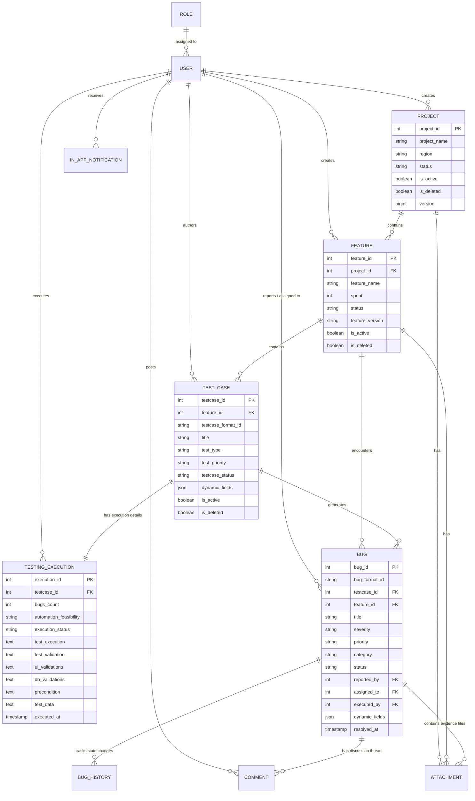
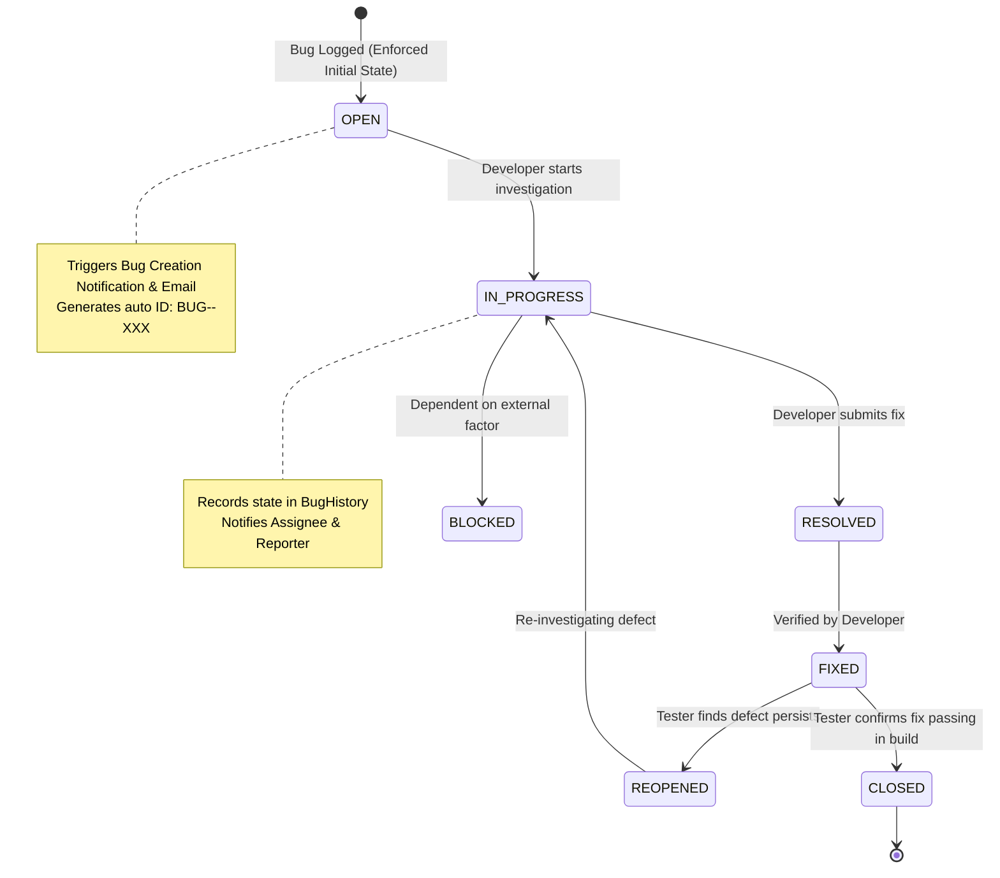

# 🧪 Testing Automation Tool (TAT) — Enterprise Quality Assurance & Defect Management Platform

[](https://www.oracle.com/java/)
[](https://spring.io/projects/spring-boot)
[](https://spring.io/projects/spring-security)
[](https://www.mysql.com/)
[](http://localhost:8090/swagger-ui/index.html)
[]()

> **Testing Automation Tool (TAT)** is a high-performance, enterprise-grade Quality Assurance, Test Lifecycle, and Defect Management platform built on **Java 21** and **Spring Boot**. It provides end-to-end management of projects, features, test case execution workflows, automated defect tracking with root cause analysis (RCA), real-time team collaboration, Excel-based bulk testing workflows, automated email & in-app alerts, and deep managerial quality health analytics.

---

## 📑 Table of Contents

- [🌟 Executive Overview & Key Capabilities](#-executive-overview--key-capabilities)
- [🏗 Architecture & Technology Stack](#-architecture--technology-stack)
- [📊 System Architecture Diagrams](#-system-architecture-diagrams)
- [🗄 Domain Model & Database Schema](#-domain-model--database-schema)
- [🔐 Security, Authentication & RBAC](#-security-authentication--rbac)
- [📈 Quality Health Score Algorithm](#-quality-health-score-algorithm)
- [🚀 Core Modules Deep-Dive](#-core-modules-deep-dive)
  - [1. User Management & Registration Approval Flow](#1-user-management--registration-approval-flow)
  - [2. Project & Feature Management](#2-project--feature-management)
  - [3. Test Case Lifecycle & Bulk Excel Processing](#3-test-case-lifecycle--bulk-excel-processing)
  - [4. Test Execution & Multi-Tier Validation](#4-test-execution--multi-tier-validation)
  - [5. Defect / Bug Tracking & History Audit](#5-defect--bug-tracking--history-audit)
  - [6. Real-Time Collaboration & Attachment System](#6-real-time-collaboration--attachment-system)
  - [7. Dual Notification Engine (Email + In-App)](#7-dual-notification-engine-email--in-app)
  - [8. Executive Analytics Dashboard](#8-executive-analytics-dashboard)
- [🌐 REST API Reference Guide](#-rest-api-reference-guide)
- [⚙️ Configuration & Environment Variables](#️-configuration--environment-variables)
- [🛠 Quickstart & Deployment Guide](#-quickstart--deployment-guide)
- [📁 Project Directory Structure](#-project-directory-structure)

---

## 🌟 Executive Overview & Key Capabilities

The **Testing Automation Tool** addresses the complexities of modern software quality engineering by integrating test authoring, test execution, bug lifecycle management, and manager analytics into a unified REST-driven architecture.

### ✨ Key Platform Features
- 👥 **Role-Based Access Control (RBAC)**: Fine-grained permissions across `ADMIN`, `MANAGER`, `TESTER`, and `DEVELOPER` roles.
- 🚦 **Manager User Approval Flow**: Self-registered users remain in a pending state until reviewed and activated by a Manager with assigned roles.
- 📋 **Test Case Suite & Dynamic Attributes**: Manual test case authoring with flexible JSON-based custom dynamic attributes (`@JdbcTypeCode(SqlTypes.JSON)`).
- 📊 **Excel Bulk Import & Dynamic Template Generation**: Streamlined Apache POI engine for downloading formatted `.xlsx` templates and importing hundreds of test cases in a single upload.
- 🎯 **Unified Test Execution Logging**: Detailed logging of manual & automated runs including UI validations, DB validations, preconditions, test data, and execution steps.
- 🐛 **Defect Automation & ID Generator**: Standardized bug numbering (`BUG-<FEATURE_NAME>-001`), state machine enforcement, assignee tracking, and historical audit logs.
- 💬 **Collaborative Bug Chat & Attachments**: Discussion threads with multi-format file attachment support (ZIP downloads, images, logs, docs).
- 📧 **Asynchronous Notification Engine**: HTML email templates via Spring Mail (SMTP/TLS) and in-app notifications for defect assignments, reassignments, resolutions, and comments.
- 📊 **Executive Quality Health Index**: Proprietary calculation factoring in test pass rates, total execution density, critical blocker defects, and high-severity bugs.
- 🖥 **Built-in Web Interfaces**: Includes interactive single-page dashboards:
  - `manager-dashboard.html`: Live executive analytics and user approval control center.
  - `bug-chat.html`: Real-time defect discussion and thread management.

---

## 🏗 Architecture & Technology Stack

```
                                 ┌──────────────────────────────────────────────┐
                                 │          Client Tier (Web / Mobile / API)    │
                                 │   - Swagger UI / Postman                     │
                                 │   - Manager Dashboard (HTML/JS)              │
                                 │   - Bug Collaboration Chat (HTML/JS)         │
                                 └──────────────────────┬───────────────────────┘
                                                        │ HTTP / JSON (Port 8090)
                                                        ▼
                                 ┌──────────────────────────────────────────────┐
                                 │         Spring Security & Filter Chain       │
                                 │   - JwtAuthenticationFilter                  │
                                 │   - DaoAuthenticationProvider (BCrypt)       │
                                 │   - Role-Based Endpoint Authorizers          │
                                 └──────────────────────┬───────────────────────┘
                                                        │
                                                        ▼
                                 ┌──────────────────────────────────────────────┐
                                 │              REST Controller Tier            │
                                 │ Auth | Project | Feature | TestCase | Bug    │
                                 │ Dashboard | Comment | Notification           │
                                 └──────────────────────┬───────────────────────┘
                                                        │ DTO / MapStruct
                                                        ▼
                                 ┌──────────────────────────────────────────────┐
                                 │             Service Business Logic           │
                                 │ - Quality Health Calculator                  │
                                 │ - Excel POI Importer / Template Generator    │
                                 │ - Async Email Service (JavaMailSender)       │
                                 │ - Bug ID Generator & History Tracking        │
                                 └───────────┬──────────────────────┬───────────┘
                                             │                      │
                      ┌──────────────────────▼──────┐        ┌──────▼───────────────────────┐
                      │    Spring Data JPA Repos    │        │      Caffeine Local Cache     │
                      │  Hibernate 6 ORM + Auditing │        │  - Error Mappings            │
                      └──────────────┬──────────────┘        └──────────────────────────────┘
                                     │ JDBC
                                     ▼
                      ┌─────────────────────────────┐
                      │    MySQL Relational DB      │
                      │  (JSON columns, soft-deletes)│
                      └─────────────────────────────┘
```

### Core Technologies
| Category | Technology | Version / Details |
| :--- | :--- | :--- |
| **Runtime Environment** | OpenJDK | Java 21 LTS |
| **Framework** | Spring Boot | 4.1.1 (Spring 6.x stack) |
| **Security** | Spring Security & JJWT | Stateless JWT (`jjwt-api 0.12.6`), BCrypt Password Encoder |
| **ORM / Persistence** | Spring Data JPA / Hibernate | Hibernate 6 with `@JdbcTypeCode(SqlTypes.JSON)` |
| **Database** | MySQL | MySQL Connector/J 8.x |
| **Data Mapping** | MapStruct | 1.6.3 + Lombok MapStruct Binding |
| **Office Spreadsheet** | Apache POI | 5.4.1 (XSSF / OOXML) |
| **Caching** | Caffeine Cache | In-memory caching with 1-hour TTL |
| **Mail & Alerts** | Spring Starter Mail | JavaMailSender with Async SMTP / StartTLS |
| **API Documentation** | SpringDoc OpenAPI | 3.0.0 (OpenAPI 3 / Swagger UI) |
| **Code Generation** | Project Lombok | Boilerplate elimination (Getters, Setters, Builders) |

---

## 📊 System Architecture Diagrams

### 1. High-Level Entity Relationship Diagram (ERD)



---

### 2. Defect Lifecycle & Audit Workflow



---

## 🔐 Security, Authentication & RBAC

The application implements a stateless **Spring Security 6** architecture secured with **JSON Web Tokens (JWT)** and **BCrypt** hashing.

### Role Hierarchy & Matrix

| Module / Endpoint Path | Allowed Roles | Description |
| :--- | :--- | :--- |
| `POST /auth/register` | `PUBLIC` | Open registration for new accounts |
| `POST /auth/login` | `PUBLIC` | Authenticate and obtain JWT token |
| `GET /auth/profile` | `ANY AUTHENTICATED` | Retrieve current user profile |
| `POST /auth/change-password` | `ANY AUTHENTICATED` | Self-service password change |
| `/manager/**` | `MANAGER`, `ADMIN` | Manager Analytics Dashboard, User Approval / Rejection |
| `PATCH /project/access/{id}` | `MANAGER` | Soft disable/enable project access |
| `DELETE /project/delete/{id}` | `MANAGER` | Soft delete project |
| `DELETE /project/{id}` | `MANAGER` | Permanent purge of project |
| `/project/**` | `MANAGER`, `TESTER`, `ADMIN` | Project CRUD, search, and attachments |
| `/feature/**` | `MANAGER`, `TESTER`, `ADMIN` | Feature CRUD, search, pagination, attachments |
| `/testcases/**` | `MANAGER`, `TESTER`, `ADMIN` | Test case CRUD, Excel uploads, template downloads |
| `/bugs/**` | `MANAGER`, `TESTER`, `ADMIN` | Defect creation, global search, status updates |
| `/comments/**` | `MANAGER`, `TESTER`, `ADMIN` | Defect discussion threads |
| `/in-app-notifications/**` | `MANAGER`, `TESTER`, `ADMIN` | User notification inbox and status updates |

---

## 📈 Quality Health Score Algorithm

The system provides real-time quantitative quality scoring calculated through [DashboardServiceImpl.java](file:///c:/Users/harikrishnan.p/Desktop/Testing_Automation_Tool/TestingAutomationTool/src/main/java/xyz/mobi/testingautomationtool/service/impl/DashboardServiceImpl.java#L534-L578):

### Mathematical Formulation
$$\text{Pass Rate} = \frac{\text{Passed Test Cases}}{\text{Passed} + \text{Failed}} \times 100$$

$$\text{Base Score} = (\text{Pass Rate} \times 0.75) + 25.0$$

$$\text{Final Health Score} = \text{clamp}\Big( \text{Base Score} - (\text{Critical Defects} \times 20.0) - (\text{High Defects} \times 8.0), \, 0.0, \, 100.0 \Big)$$

### Health Rating Bands
- 🟢 **EXCELLENT** ($\ge 85\%$ score and $\ge 85\%$ pass rate with $0$ critical defects): Ready for deployment/release.
- 🟡 **GOOD** ($\ge 70\%$ score): Minor defects or pending test executions.
- 🟠 **NEEDS_ATTENTION** ($\ge 50\%$ score): Elevated failure rate requiring review before milestone.
- 🔴 **CRITICAL** ($< 50\%$ score OR any open Critical defect): Blocker defects preventing sign-off.

---

## 🚀 Core Modules Deep-Dive

### 1. User Management & Registration Approval Flow
- **Registration**: New users register via `/auth/register` providing username, email, designation, full name, skills, and target role. Newly registered accounts start with `isActive = false`.
- **Manager Approval Queue**: Managers review pending signups via `/manager/users/pending` and confirm users via `PUT /manager/userConfirmation`. Confirmation triggers an automated HTML welcome email.
- **Rejection**: Rejection via `DELETE /manager/userRejection/{userId}` purges the request and sends a notification email.

---

### 2. Project & Feature Management
- **Projects**: Organized by geographical region (`region`), lifecycle status (`ACTIVE`, `INACTIVE`, `COMPLETED`, `ARCHIVED`), and soft deletion flags.
- **Features**: Tied to projects and organized by Agile `sprint`, `featureVersion`, and status (`ACTIVE`, `IN_PROGRESS`, `COMPLETED`, `ON_HOLD`, `DEPRECATED`).
- **File Attachments**: Upload project and feature documentation directly into the system with automated `.zip` bundling for downloads.

---

### 3. Test Case Lifecycle & Bulk Excel Processing
The system provides two modes of test case authoring:

#### A. Manual Authoring
Create single test cases with fine-grained metadata (`title`, `testType`, `testPriority`, `testcaseStatus`) and an optional JSON object for custom fields.

#### B. Bulk Excel Import (`TestCaseExcelService`)
Upload a standardized `.xlsx` spreadsheet into a designated feature:
- Expected Sheet Name: `TCFormat`
- **Supported Columns**:
  1. `TestcaseID` (e.g. `TC_AUTH_001`)
  2. `Title`
  3. `Test Type` (`SMOKE`, `REGRESSION`, `FUNCTIONAL`, `NON_FUNCTIONAL`, `SANITY`, `E2E`)
  4. `Test Execution` (Manual / Automated description)
  5. `Test Validation`
  6. `Automation Priority` (`CRITICAL`, `HIGH`, `MEDIUM`, `LOW`)
  7. `Pre Condition`
  8. `Test data`
  9. `Execution steps`
  10. `UI Validations`
  11. `DB Validations`
  12. `Automation Status` (`YES`, `NO`, `PLANNED`, `IN_PROGRESS`)
  13. `Actual Status` (`PASS`, `FAIL`, `NO_RUN`, `BLOCKED`, `DESCOPE`)
  14. `Comments`
- Download dynamic blank/pre-filled templates via `GET /testcases/template/{projectId}/{featureId}`.

---

### 4. Test Execution & Multi-Tier Validation
Each test case is paired 1-to-1 with a `TestingExecution` entity tracking:
- **Automation Feasibility**: `YES`, `NO`, `PLANNED`, `IN_PROGRESS`, `DESCOPE`.
- **Execution Validations**: Specific fields for `uiValidations` and `dbValidations` to confirm backend integrity.
- **Execution Tracking**: Timestamps (`executedAt`), execution counts (`executionNumber`), and executing user identity.

---

### 5. Defect / Bug Tracking & History Audit
- **Format ID Generation**: Automatically computes formatted ID keys (e.g., `BUG-USER_AUTHENTICATION-001`) based on the feature name and highest sequence number.
- **Category & Severity**:
  - Categories: `PRE_PRODUCTION`, `PRODUCTION`, `REGRESSION`, `SECURITY`, `PERFORMANCE`, `UI_UX`.
  - Severities: `CRITICAL`, `HIGH`, `MEDIUM`, `LOW`.
  - Priorities: `CRITICAL`, `HIGH`, `MEDIUM`, `LOW`.
- **History Audit Trail**: Every assignment, reassignment, or status change writes a permanent log into `testing_bug_history`.
- **RCA Documentation**: Root cause analysis is captured in dedicated `rca_comments` fields upon bug resolution.

---

### 6. Real-Time Collaboration & Attachment System
- **Defect Discussion Threads**: Team members can post, edit, and paginate comments on specific defects via `/bugs/{bugId}/comments`.
- **Media Evidence**: Upload screenshots, stack trace logs, and screen recordings via `/bugs/{bugId}/attachments`.
- **Single / Multi-file Download**: Individual file streaming or multi-attachment ZIP compression.

---

### 7. Dual Notification Engine (Email + In-App)
- **Email Notifications** (via `EmailServiceImpl` using Gmail SMTP & CSS-styled responsive HTML):
  - 📩 *Bug Assigned Email*: Sent immediately to the assigned developer with test steps, precondition, and severity badge.
  - 🔄 *Bug Reassigned Email*: Notifies new assignee of handoff.
  - ✅ *User Approval / Welcome Email*: Notifies approved users of active system access.
  - ❌ *User Rejection Email*: Informs rejected applicants.
- **In-App Notifications** (`InAppNotificationServiceImpl`):
  - In-app notification bell counter and inbox for `BUG_FIXED`, `COMMENT_ADDED`, and status change events.

---

### 8. Executive Analytics Dashboard
The platform generates real-time analytics consumed by the manager UI (`/manager/dashboard.html`):
- 📊 **KPI Stat Cards**: Total projects, active features, test execution rate, pass rate %, total defects, open defect density.
- 🎯 **Defect Distribution Charts**: Breakdown by Severity (Critical, High, Medium, Low) and Category (Pre-production, Production, Regression).
- ⚠️ **Top Failing Features**: Ranks features with highest failure counts and open critical bugs to direct QA focus.
- 🕒 **Recent Defect Feed**: Live timeline of latest defects logged across the company.
- 👥 **Team Roster & Workload**: Active user distributions across Testers, Managers, and Developers.

---

## 🌐 REST API Reference Guide

### 1. Authentication Endpoints (`/auth`)

| Method | Endpoint | Access | Summary |
| :--- | :--- | :--- | :--- |
| `POST` | `/auth/register` | Public | Register a new user account |
| `POST` | `/auth/login` | Public | Authenticate user and receive Bearer JWT |
| `GET` | `/auth/profile` | Authenticated | Retrieve authenticated user profile |
| `POST` | `/auth/change-password`| Authenticated | Change logged-in user password |

---

### 2. Project Management (`/project`)

| Method | Endpoint | Access | Summary |
| :--- | :--- | :--- | :--- |
| `POST` | `/project` | Manager, Tester, Admin | Create a new project |
| `GET` | `/project` | Manager, Tester, Admin | List all active projects |
| `GET` | `/project/{projectId}` | Manager, Tester, Admin | Get project details by ID |
| `GET` | `/project/search` | Manager, Tester, Admin | Search projects by keyword and status |
| `PUT` | `/project/{id}` | Manager, Tester, Admin | Update full project record |
| `PATCH` | `/project/{id}` | Manager, Tester, Admin | Partial update of project |
| `PATCH` | `/project/access/{id}` | Manager | Toggle project active/inactive status |
| `DELETE`| `/project/delete/{id}` | Manager | Soft delete a project |
| `DELETE`| `/project/{id}` | Manager | Permanent delete of a project |
| `POST` | `/project/attachment/{projectId}` | Manager, Tester, Admin | Upload project attachment |
| `GET` | `/project/projects/{projectId}/attachments/download` | Manager, Tester, Admin | Download project attachments (ZIP) |

---

### 3. Feature Management (`/feature`)

| Method | Endpoint | Access | Summary |
| :--- | :--- | :--- | :--- |
| `POST` | `/feature` | Manager, Tester, Admin | Create a new feature in a project |
| `GET` | `/feature/{featureId}` | Manager, Tester, Admin | Get feature details by ID |
| `GET` | `/feature/project/{projectId}` | Manager, Tester, Admin | List features belonging to a project |
| `GET` | `/feature/search` | Manager, Tester, Admin | Paginated search of features |
| `PUT` | `/feature/{featureId}` | Manager, Tester, Admin | Update feature record |
| `PATCH` | `/feature/{featureId}` | Manager, Tester, Admin | Partial update of feature |
| `DELETE`| `/feature/{featureId}` | Manager, Tester, Admin | Soft delete a feature |
| `POST` | `/feature/attachment/{featureId}` | Manager, Tester, Admin | Upload feature documentation |
| `GET` | `/feature/features/{featureId}/attachments/download` | Manager, Tester, Admin | Download feature attachments |

---

### 4. Test Case & Execution Management (`/testcases`)

| Method | Endpoint | Access | Summary |
| :--- | :--- | :--- | :--- |
| `POST` | `/testcases` | Manager, Tester, Admin | Create test case manually with execution details |
| `POST` | `/testcases/upload` | Manager, Tester, Admin | Bulk import test cases via Excel file (`.xlsx`) |
| `GET` | `/testcases/template/{projectId}/{featureId}` | Manager, Tester, Admin | Download pre-formatted Excel test case template |
| `GET` | `/testcases` | Manager, Tester, Admin | Get paginated list of test cases with filters |
| `GET` | `/testcases/{id}` | Manager, Tester, Admin | Get test case by ID |
| `GET` | `/testcases/search` | Manager, Tester, Admin | Multi-parameter search on test cases |
| `PUT` | `/testcases/{id}` | Manager, Tester, Admin | Full update of test case and execution |
| `PATCH` | `/testcases/{id}` | Manager, Tester, Admin | Partial update of test case status/priority |
| `DELETE`| `/testcases/soft/{id}` | Manager, Tester, Admin | Soft delete test case |
| `DELETE`| `/testcases/{id}` | Manager, Tester, Admin | Hard delete test case |

---

### 5. Defect / Bug Tracking (`/bugs`)

| Method | Endpoint | Access | Summary |
| :--- | :--- | :--- | :--- |
| `POST` | `/bugs` | Manager, Tester, Admin | Log a new defect (auto-generates format ID) |
| `GET` | `/bugs/{bugId}` | Manager, Tester, Admin | Get defect details |
| `GET` | `/bugs` | Manager, Tester, Admin | Paginated list of all defects |
| `PUT` | `/bugs/{bugId}` | Manager, Tester, Admin | Update defect details |
| `PATCH` | `/bugs/{bugId}` | Manager, Tester, Admin | Update status/assignee (logs history & sends email) |
| `PATCH` | `/bugs/delete/{bugId}` | Manager, Tester, Admin | Soft delete defect |
| `DELETE`| `/bugs/{bugId}` | Manager, Tester, Admin | Hard delete defect |
| `GET` | `/bugs/search` | Manager, Tester, Admin | Global multi-filter defect search |
| `POST` | `/bugs/{bugId}/attachments` | Manager, Tester, Admin | Upload bug screenshot or log attachment |
| `GET` | `/bugs/{bugId}/attachments` | Manager, Tester, Admin | List attachments for bug |
| `GET` | `/bugs/attachments/{attachmentId}/download` | Manager, Tester, Admin | Download attachment file |

---

### 6. Defect Comments & Discussion (`/bugs/{bugId}/comments` & `/comments`)

| Method | Endpoint | Access | Summary |
| :--- | :--- | :--- | :--- |
| `POST` | `/bugs/{bugId}/comments` | Manager, Tester, Admin | Post comment on defect |
| `GET` | `/bugs/{bugId}/comments` | Manager, Tester, Admin | Get all comments for defect |
| `GET` | `/bugs/{bugId}/comments/page` | Manager, Tester, Admin | Paginated comment list |
| `PUT` | `/comments/{commentId}` | Manager, Tester, Admin | Update existing comment |
| `DELETE`| `/comments/{commentId}` | Manager, Tester, Admin | Delete comment |

---

### 7. Manager Analytics & Approvals (`/manager`)

| Method | Endpoint | Access | Summary |
| :--- | :--- | :--- | :--- |
| `GET` | `/manager/dashboard/overview` | Manager, Admin | Full system KPI metrics and quality health scores |
| `GET` | `/manager/dashboard/project/{projectId}` | Manager, Admin | Project-specific quality and test breakdown |
| `GET` | `/manager/dashboard/feature/{featureId}` | Manager, Admin | Feature-specific metrics and defect count |
| `GET` | `/manager/users/active` | Manager, Admin | List all active users |
| `GET` | `/manager/users/pending` | Manager, Admin | List users pending registration approval |
| `PUT` | `/manager/userConfirmation` | Manager, Admin | Approve user and assign role (sends welcome email) |
| `DELETE`| `/manager/userRejection/{userId}` | Manager, Admin | Reject pending user registration |

---

### 8. In-App Notifications (`/in-app-notifications`)

| Method | Endpoint | Access | Summary |
| :--- | :--- | :--- | :--- |
| `GET` | `/in-app-notifications` | Authenticated | Retrieve notifications for current user |
| `PATCH` | `/in-app-notifications/{notificationId}`| Authenticated | Mark notification as read |
| `DELETE`| `/in-app-notifications/{notificationId}`| Authenticated | Delete notification |

---

## ⚙️ Configuration & Environment Variables

All configuration is centralized in [application.properties](file:///c:/Users/harikrishnan.p/Desktop/Testing_Automation_Tool/TestingAutomationTool/src/main/resources/application.properties) and can be overridden via system environment variables:

| Variable Name | Default Value | Description |
| :--- | :--- | :--- |
| `server.port` | `8090` | HTTP port on which the application listens |
| `server.address` | `0.0.0.0` | Bind IP address |
| `DB_URL` | `jdbc:mysql://192.168.11.101:3306/Interns_db?...` | MySQL JDBC connection string |
| `DB_USERNAME` | *(Required in Prod)* | MySQL database username |
| `DB_PASSWORD` | *(Required in Prod)* | MySQL database password |
| `JWT_SECRET` | `404E635266556A586E32...` | 256-bit secret key used to sign HMAC-SHA256 JWT tokens |
| `JWT_EXPIRATION_MS` | `86400000` (24 Hours) | JWT token lifespan in milliseconds |
| `spring.mail.host` | `smtp.gmail.com` | SMTP host for sending emails |
| `spring.mail.port` | `587` | SMTP port (STARTTLS) |
| `spring.mail.username` | `vikramraajak@gmail.com` | SMTP sender account username |
| `spring.mail.password` | `pwnpavuwnjacbbdh` | SMTP App Password / Auth credential |

---

## 🛠 Quickstart & Deployment Guide

### Prerequisites
- **Java Development Kit (JDK)**: Version 21 LTS or newer
- **Apache Maven**: Version 3.9+ (or use the included `./mvnw` wrapper)
- **MySQL Server**: Version 8.0+

### 1. Clone the Repository
```bash
git clone https://github.com/internslab-mobi/Testing_Automation_Tool.git
cd Testing_Automation_Tool/TestingAutomationTool
```

### 2. Configure Database & Environment
Set your database credentials:
```bash
# Windows PowerShell
$env:DB_URL="jdbc:mysql://localhost:3306/interns_db?useSSL=false&allowPublicKeyRetrieval=true"
$env:DB_USERNAME="root"
$env:DB_PASSWORD="your_password"
```

### 3. Build & Run Application
Using the Maven wrapper:
```bash
# Build the project
./mvnw clean package -DskipTests

# Run the Spring Boot application
./mvnw spring-boot:run
```

Once started, the backend will listen on **`http://localhost:8090`**.

### 4. Access Interactive Documentation & Dashboards
- **Swagger / OpenAPI 3 UI**: [http://localhost:8090/swagger-ui/index.html](http://localhost:8090/swagger-ui/index.html)
- **OpenAPI JSON Spec**: [http://localhost:8090/v3/api-docs](http://localhost:8090/v3/api-docs)
- **Manager Analytics Dashboard**: [http://localhost:8090/manager-dashboard.html](http://localhost:8090/manager-dashboard.html)
- **Bug Collaboration Chat UI**: [http://localhost:8090/bug-chat.html](http://localhost:8090/bug-chat.html)

---

## 📁 Project Directory Structure

```
TestingAutomationTool/
├── pom.xml                               # Maven Project Descriptor (Java 21, Spring Boot 4.1.1)
├── README.md                             # Comprehensive Platform Documentation
├── src/
│   ├── main/
│   │   ├── java/xyz/mobi/testingautomationtool/
│   │   │   ├── TestingAutomationToolApplication.java # Spring Boot Application Main Class
│   │   │   ├── audit/                    # JPA Auditing Support (CreatedDate, LastModifiedDate)
│   │   │   │   └── Auditable.java
│   │   │   ├── config/                   # OpenApiConfig, DataInitializer (Role bootstrap)
│   │   │   ├── controller/               # REST Endpoints (Auth, Bug, Project, Feature, TestCase, Dashboard, etc.)
│   │   │   ├── dto/                      # Data Transfer Objects organized by domain
│   │   │   ├── entity/                   # JPA Database Entities (Project, TestCase, Bug, User, etc.)
│   │   │   ├── enums/                    # Status and Category Enums (BugStatus, TestPriority, etc.)
│   │   │   ├── exception/                # GlobalExceptionHandler & ErrorCode Catalog
│   │   │   ├── mapper/                   # MapStruct Entity-DTO Mappers
│   │   │   ├── repository/               # Spring Data JPA Repositories
│   │   │   ├── security/                 # JWT Filter, CustomUserDetails, SecurityConfig
│   │   │   ├── service/                  # Business Logic Interfaces
│   │   │   │   └── impl/                 # Service Implementations (Bug, TestCase, Excel, Email, Dashboard)
│   │   │   ├── specification/            # Dynamic JPA Query Specifications (BugSpecification, FeatureSpecification)
│   │   │   └── utils/                    # Date & JSON Utility Converters
│   │   └── resources/
│   │       ├── application.properties    # Centralized Configuration
│   │       └── static/                   # Static Frontend UIs (manager-dashboard.html, bug-chat.html)
│   └── test/                             # Unit & Integration Test Suites
```

---

## 🤝 Contribution & Team Best Practices

1. **Branching Strategy**: Use feature branches (`feature/TAT-xxx`) branching off `main`.
2. **Code Style**: Follow standard Java 21 conventions with MapStruct and Lombok.
3. **Soft Deletions**: Always prefer soft deletion (`isDeleted = true`) over physical deletes to maintain audit history.
4. **Defect Lifecycle**: Never create bugs directly in non-`OPEN` states; rely on the state transition endpoints to update bug histories and trigger automated team notifications.

---
*Developed with ❤️ by the Testing Automation Platform Engineering Team.*
